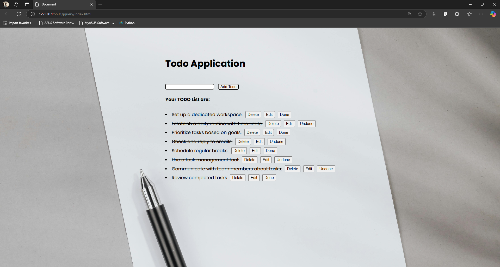

To-Do List Web Application 📝✅
A simple and interactive To-Do List web application built using HTML, CSS, JavaScript, and jQuery. This app allows users to add, edit, mark tasks as completed, and delete them with an intuitive UI.

✨ Features:

    🔹 ➕ Add tasks dynamically.
    🔹 ✏️ Edit existing tasks.
    🔹 ✅ Mark tasks as Done/Undone.
    🔹 🗑️ Delete tasks when no longer needed.
    🔹 🎨 Simple and responsive design.

🚀 Technologies Used:

    💻 HTML, CSS, JavaScript,jQuery

🔧 How to Use:

    🖊️ Enter a task in the input field.
    📌 Click "Add" to include it in the list.
    ✔️ Use "Done" to mark tasks as completed.
    ✏️ Click "Edit" to modify a task.
    🗑️ Use "Delete" to remove tasks.

📸 Screenshot:

    

    
